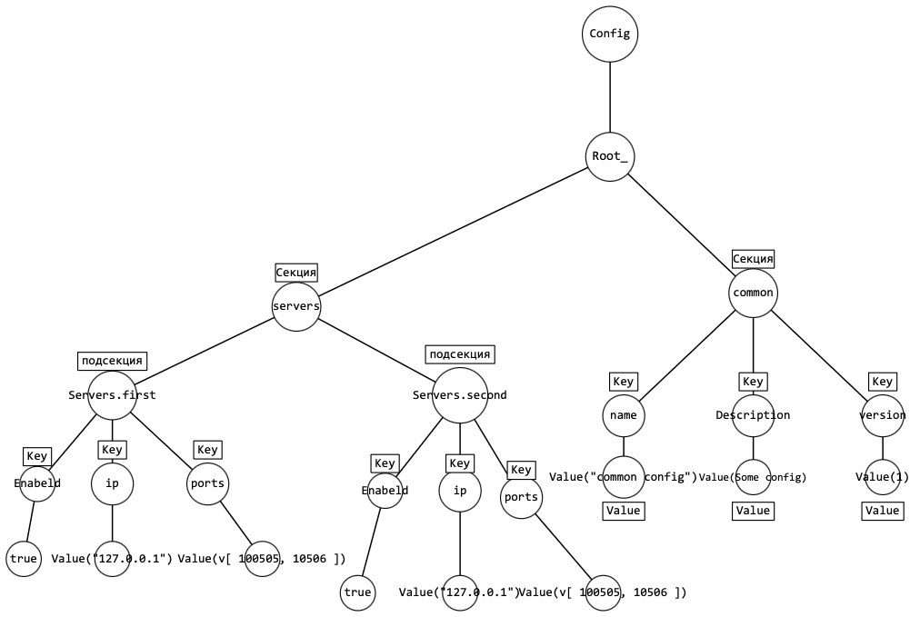
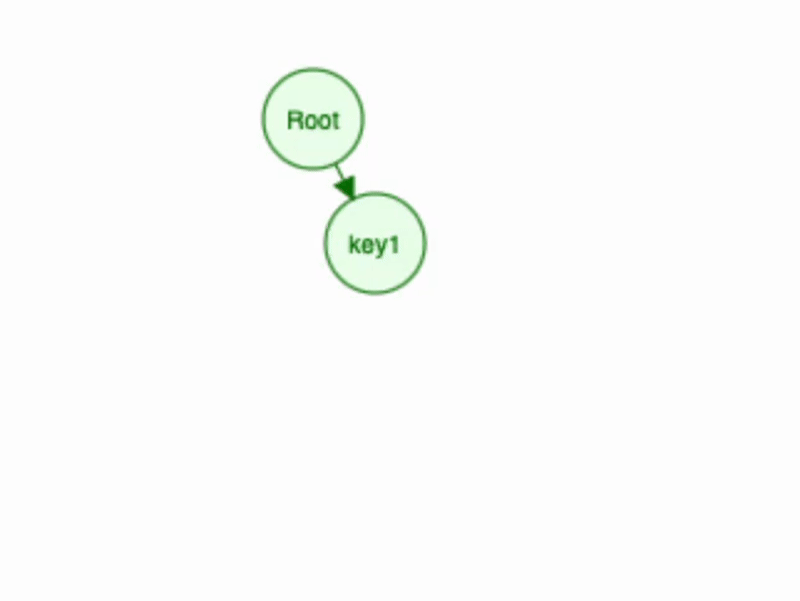

# OMFL file parser
##
OMFL - это формат для хранения конфигурационных файлов. По своей природе он похож на ini, но является более гибким. Основной его целью является возможность получать из конфига значение по определенному ключу и логическое разделение на секции и подсекции.
##

## Формат

OMFL-файл это текстовый файл в кодировке ASCII формате OMFL. Далее будет описана спецификация формата. Основной конструкцией для OMFL является пара KeyValue.
Формат чувствителен к регистру. Пробелы и пустые строки игнорируются.

``` пример файла лежит в папке examples``` 
## Основная задача

Необходимо было грамотно спарсить сам файл, пройти покрытие тестами, реализовать структуру данных для хранения информации и небоходимый интерфейс для взаимодействия с ней, сам парсер должен иметь поддержку следующих типов данных для значений:
``` 
ключ = значение
[секция]
[секция.подсекция]
```

Также нужно предусматривать ,что в виде значений по ключам могут быть разные типы данных ,такие как: ```float ,int, bool, string, array```.
>**Примечание:* более подробно с поставленной задачей можно ознакомится в README документе в папке task
###

## Реализация
Выполнять работу я начал с того ,что придумал структуру данных ,для хранения секций , подсекций и ключ значений в них. Наиболее оптимальным и удобным вариантом из всех мне показалось n-ное дерево ,реализация лежит в файлах ```value.h``` и ```value.cpp```. Также я специально визиулизировал на примере файла из папки examples то ,как хранятся данные:




>**Примечание** Config является классом-оболочкой для хранения обьекта Value root_.

Простая визуализация добавления значения по ключу в дерево c помощью метода SetKeyValue:

```cpp
void Value::SetKeyValue(const std::string& key, const Value& value) {
    if(!IsSection()) {
        data_ = std::map<std::string, Value>();
    }

    std::get<std::map<std::string, Value>>(*data_)[key] = value;
}
```



Основная логика парсинга реализована в функции

```Config parse(const std::string& str) ```

>**Примечание** в данный момент проект больше нацелен на работу с файлами небольшого размера ,поэтому функция parse принимает на вход строку, в которой лежит содержимое файла

В нее приходит строка ,далее путь разбивается на строки ,для каждой из которых определяется тип (секция или ключ=значение) после чего ,если это секция ,то из Config изымается Root Value и она добавляется в root как std::map с ключем в виде ее названия , если же перед нами ключ=значение ,то мы парсим значение и определяем его тип ,после чего с помощью 
```cpp std::vector<std::string> current_section_path;``` находим нынешнюю секцию и добавляем в дерево.

##

### Пример рабты проекта:

##
```cpp
int main(int, char**) {
    auto root_ = parse("/Users/mikle/Desktop/labwork 3/example/config.omfl", true);

    std::cout << root_.valid() << '\n';

    std::string tr = root_.Get("servers.first").Get("ip").AsString();

    std::cout << tr << '\n';

    return 0;
}
```

В примере указан путь до файла config.omfl из examples

Результат работы программы следующий:
```127.0.0.1``` ,так как в секции servers.first по ключу ip лежит строка "127.0.0.1"

##
## Пример Использования
Чтобы использовать проект необходимо сколнировать репозиторий с помощью команды ```git clone```

После чего зайти в терминале перейти в build/bin/ откуда запустить файл ./lab6
## 
## Покрытие тестами 
Был также добавлен simple workflows и настроен авоматический запуск тестов при пуше, тесты пройдены успешно.
 
